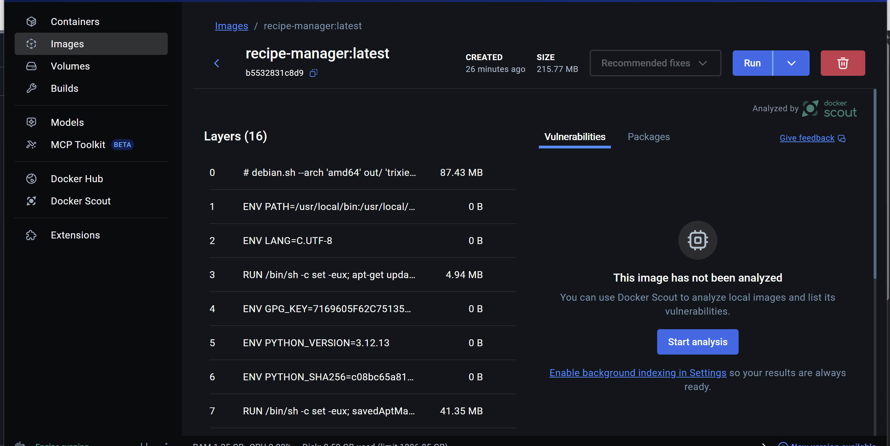
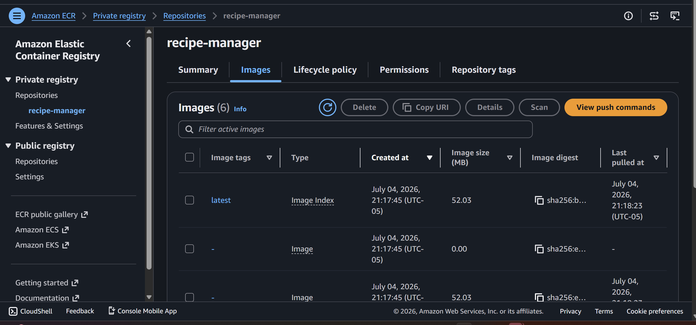
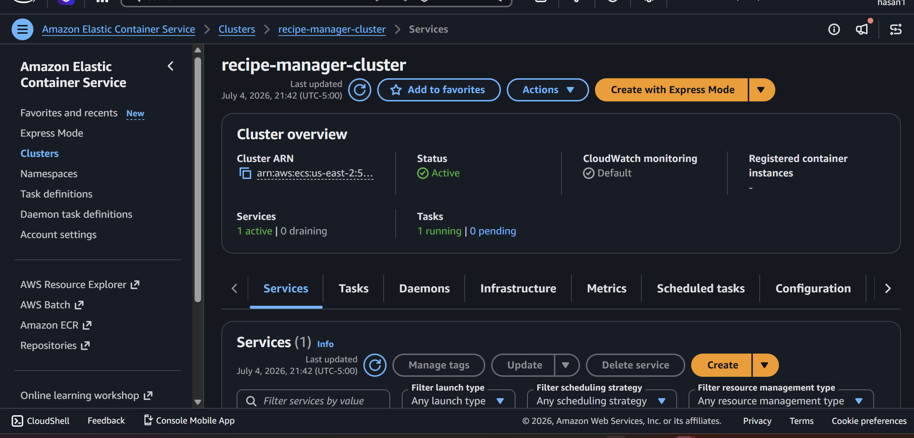
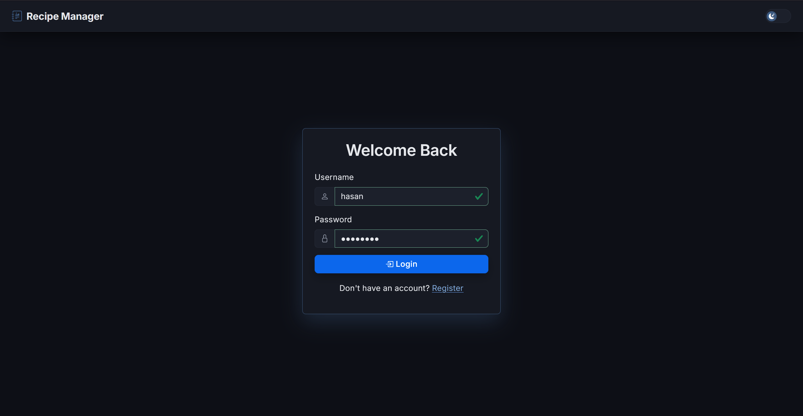
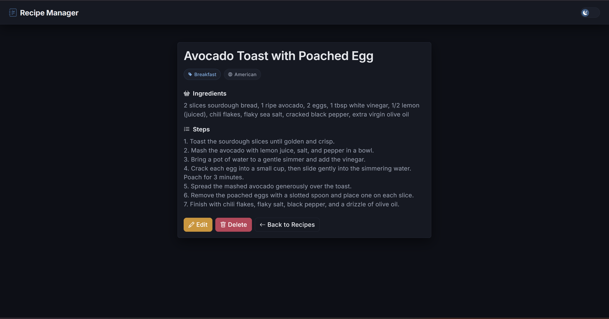
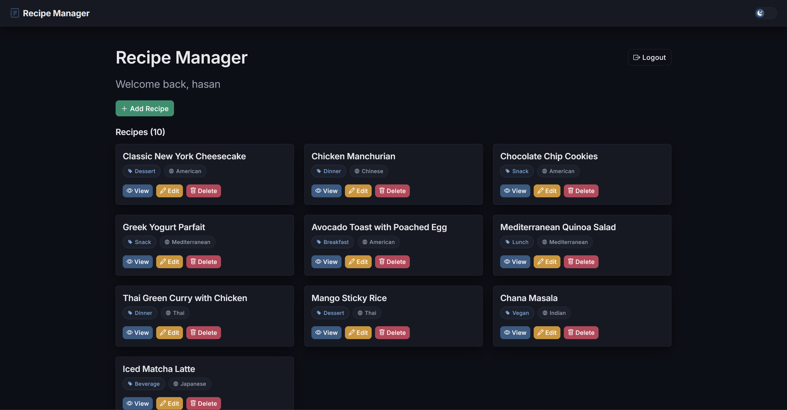

# Recipe Manager — Flask + MongoDB + Docker + AWS ECS Fargate

A full-stack recipe management web app built with **Flask** and **MongoDB Atlas**, containerized with **Docker**, and deployed to production on **AWS ECS Fargate** via **ECR**. Users register, log in, and manage a private collection of recipes with full CRUD.

This project started as a local Flask + MongoDB app and was progressively hardened and shipped to the cloud: environment-based secrets, a redesigned UI, containerization, and a full AWS deployment pipeline (ECR → Secrets Manager → ECS Fargate).

📄 **[Full deployment workflow write-up (PDF)](Recipe-Manager-Deployment-Workflow.pdf)** — architecture diagram, step-by-step pipeline, and lessons learned.

---

## Features

- User authentication (register/login/logout) via `Flask-Login`, with hashed passwords (`werkzeug.security`)
- Full CRUD for recipes — title, ingredients, steps, category, cuisine — scoped per user
- Client-side form validation (Bootstrap validation states, password-confirmation matching)
- Dark/light theme toggle (persisted via `localStorage`), Inter typeface, Bootstrap Icons
- Containerized with Docker, served via Gunicorn (multi-worker, threaded)
- Deployed on AWS ECS Fargate, image hosted in Amazon ECR, secrets in AWS Secrets Manager

## Deployment Steps in Screenshots

**Step 1 — Docker image built locally**


**Step 2 — Image pushed to Amazon ECR**


**Step 3 — Running on an ECS Fargate cluster**


**Step 4 — Application login**


**Step 5 — Recipe detail view**


**Step 6 — Recipe dashboard**


## Tech Stack

**Backend:** Flask, Flask-Login, Flask-PyMongo, Gunicorn
**Database:** MongoDB Atlas (managed, cloud-hosted)
**Frontend:** Jinja2, Bootstrap 5, Bootstrap Icons, vanilla JS
**Infrastructure:** Docker, Amazon ECR, Amazon ECS (Fargate), AWS Secrets Manager, CloudWatch Logs

## Architecture

```
Browser
   │
   ▼
ECS Fargate Task (awsvpc networking, public IP)
   │  Gunicorn (2 workers × 2 threads) → Flask app
   │  Secrets injected at runtime from AWS Secrets Manager
   ▼
MongoDB Atlas (managed replica set, TLS)
```

The container image is built locally, pushed to a private **ECR** repository, and run as a Fargate task with no underlying EC2 instances to manage. `MONGO_URI` and `SECRET_KEY` are never baked into the image — they're injected at container start from **AWS Secrets Manager** via the ECS task definition.

---

## Local Development

```bash
python -m venv venv
venv\Scripts\activate        # Windows
pip install -r requirements.txt
cp .env.example .env         # then fill in your own MONGO_URI and SECRET_KEY
python app.py
```

## Running with Docker

```bash
docker build -t recipe-manager .
docker run -p 5000:5000 --env-file .env recipe-manager
```

> **Note:** `.env` values must **not** be wrapped in quotes (`MONGO_URI=mongodb+srv://...`, not `MONGO_URI="mongodb+srv://..."`). `python-dotenv` strips quotes automatically for local runs, but Docker's `--env-file` does not — quoted values will pass the literal quote character into the app and break the Mongo connection string.

---

## Deploying to AWS (ECR + ECS Fargate)

High-level pipeline: **Docker image → ECR → Secrets Manager → ECS task definition → ECS cluster/service**.

### 1. Push the image to ECR
```bash
aws ecr create-repository --repository-name recipe-manager --region <region>
aws ecr get-login-password --region <region> | docker login --username AWS --password-stdin <account-id>.dkr.ecr.<region>.amazonaws.com
docker tag recipe-manager:latest <account-id>.dkr.ecr.<region>.amazonaws.com/recipe-manager:latest
docker push <account-id>.dkr.ecr.<region>.amazonaws.com/recipe-manager:latest
```

### 2. Store secrets in Secrets Manager
```bash
aws secretsmanager create-secret --name recipe-manager/mongo-uri --secret-string "<your-mongo-uri>" --region <region>
aws secretsmanager create-secret --name recipe-manager/secret-key --secret-string "<your-secret-key>" --region <region>
```

### 3. Register the task definition
See [`task-definition.example.json`](task-definition.example.json) for the full template — it wires the container to the ECR image, the two secrets above, and a CloudWatch log group. Fill in your account ID, region, and secret ARNs, then:
```bash
aws ecs register-task-definition --cli-input-json file://task-definition.json --region <region>
```

### 4. Create the cluster, security group, and service
```bash
aws ecs create-cluster --cluster-name recipe-manager-cluster --region <region>
aws ec2 create-security-group --group-name recipe-manager-sg --description "Recipe manager SG" --vpc-id <vpc-id>
aws ec2 authorize-security-group-ingress --group-id <sg-id> --protocol tcp --port 5000 --cidr 0.0.0.0/0
aws ecs create-service \
  --cluster recipe-manager-cluster \
  --service-name recipe-manager-service \
  --task-definition recipe-manager-task \
  --desired-count 1 \
  --launch-type FARGATE \
  --network-configuration "awsvpcConfiguration={subnets=[<subnet-ids>],securityGroups=[<sg-id>],assignPublicIp=ENABLED}"
```

The running task's public IP can be found via `ecs describe-tasks` → its ENI → `ec2 describe-network-interfaces`.

---

## Persistent Storage

Fargate tasks are **ephemeral by design** — any file written inside the container's own filesystem is lost the moment the task restarts, redeploys, or scales. This app avoids that problem entirely by keeping all persistent data outside the container:

- **All application data lives in MongoDB Atlas**, a managed database completely decoupled from the container lifecycle. Whether the task restarts, redeploys, or scales to multiple instances, every instance reads/writes the same external database — there's no per-container data silo.
- **Sessions are stateless.** `Flask-Login` signs session cookies with `SECRET_KEY` and stores them client-side in the browser, not in server memory. Any instance can serve any request without a shared session store, since `SECRET_KEY` is identical across instances (injected from the same Secrets Manager secret).
- **Write durability**: the Mongo connection string includes `retryWrites=true&w=majority`, meaning writes are acknowledged by a majority of the Atlas replica set before the app gets a success response — no risk of losing an acknowledged write to a single-node failure.
- This app doesn't currently handle file uploads (e.g. recipe photos). If that were added, those files would need to go to **Amazon S3** rather than the container's local disk, for the same ephemeral-storage reason.

## Lessons Learned / Troubleshooting Notes

A few real issues hit during this deployment, worth knowing if you're doing this yourself:

- **`.env` values in quotes break Docker's `--env-file`.** `python-dotenv` strips quotes; Docker does not. A quoted `MONGO_URI` passes a literal `"` character into the connection string and PyMongo rejects it as an invalid URI.
- **Gunicorn's default single sync worker is fragile in production.** With only one worker and no request timeout tuning, a single slow/incomplete connection (e.g. a port scanner that opens a socket and never sends data) can block the whole app until Gunicorn's 30s default timeout kills the worker. Fixed by running multiple workers with threads: `gunicorn --workers 2 --threads 2 --timeout 60 app:app`.
- **Exposing a raw container port directly to the internet invites scanner traffic.** With the security group open on `0.0.0.0/0` and no load balancer in front, automated bots constantly probe the port. An Application Load Balancer in front (with the security group locked down to ALB-only) is the proper fix, along with giving the service a stable DNS name instead of a Fargate task's ephemeral public IP.
- **Chrome's "Always use secure connections" (HTTPS-First Mode) can make a plain-HTTP deployment look broken.** Chrome will attempt to upgrade a typed `http://` address to HTTPS; without a TLS listener behind that port, the connection just hangs until it times out. Firefox and Edge didn't exhibit this. Real fix: put HTTPS in front via an ALB + ACM certificate.
- **A `ServerSelectionTimeoutError` / TLS alert from MongoDB does not necessarily mean an AWS permissions or security-group problem.** If the client got far enough to receive a TLS alert *from Atlas*, the network path (security group, routing, DNS) already worked — the rejection happened at the TLS/Atlas layer, not the AWS layer. Diagnosing "which layer actually failed" from the error message saved a lot of wasted effort second-guessing IAM and security groups that were already correct.

## License

This project is for portfolio/educational purposes.
